# Identifying Surfer's Experience Group Based on Performed Manoeuvres 

Guilherme Branco Loureiro		-		Florianópolis - SC - Brazil		-		September 29th, 2019

### Udacity's Capstone Project - Machine Learning Engineer Nanodegree

------

# 1. Definition

## 1.1 Project Overview

### 1. Domain Background 

Research about surfboard is scarce.
A query for 'Surfboard' in [Scopus](https://www.scopus.com/results/results.uri?numberOfFields=0&src=s&clickedLink=&edit=&editSaveSearch=&origin=searchbasic&authorTab=&affiliationTab=&advancedTab=&scint=1&menu=search&tablin=&searchterm1=surfboard&field1=TITLE_ABS_KEY&dateType=Publication_Date_Type&yearFrom=Before+1960&yearTo=Present&loadDate=7&documenttype=All&accessTypes=All&resetFormLink=&st1=surfboard&st2=&sot=b&sdt=b&sl=24&s=TITLE-ABS-KEY%28surfboard%29&sid=836201fdfd01a316e29aaf87c508a17e&searchId=836201fdfd01a316e29aaf87c508a17e&txGid=e849352791f4cd3a5c7fa87e60011e9d&sort=plf-f&originationType=b&rr=) results only 235 documents (by September 2019). 
Surfing is a sport in which a surfer performs manouevres over the surface of a wave with a surfboard.
The more experienced the surfer, the more complex manoeuvres he's able to perform.
The right surfboard specification implies in acknowledging theses features and translating them into surfboard specs.
Therefore, strong correlation between the surfer's **experience level** and the range of **manoeuvres** is expected. 
The objective of this work is to propose a **supervised** approach to predict the surfers experience level given a set of manoeuvres.

There are no publications about this correlation (experience X manoeuvres), nor a, experience prediction application based on surfing's performed manoeuvres. 

This problem is relevant because it could contribute to the surfboard specification process, making recommendation more assertive.

The problem's understanding is aided by the **dimensionality reduction** provided by the Principal Component Analysis (PCA), which allows ten dimensions to be seen as only two in a byplot graph.

The **supervised** problem might is solved with a decision tree.

Related researches approach manoeuvres as follows:

- [Lundgren et al (2014)][1] analyses Manoeuvres and Scoring in Competitive Surfing;
- [Weaver e Bannerot (2009)][2] describe surfing manoeuvres.
- [Peirão e Santos (2011)][3] describe surfing manoeuvres.
- [Robison (2010)][4] graphically represent the manoeuvres.
- [Moreira e Peixoto (2014)][5] empirically group manoeuvres.
- [Lundgren et al. (2014)][6] describe the frequency of execution of manoeuvres in a championship.
- [Hutt et al. (2001)][7] propose a surfer level classification based on manoeuvres, without any clustering technique.
- [Mendez Villanueva et al. (2006)][8] show how the different surfing activities are divided.
- [Secomb et al. (2015)][9] present some statistics about surfing activities.

As a surfer for more than ten years, it's still not clear what is my level of experience. I'm confident many also have this doubt and may benefit from this project.


### 2. Datasets and Inputs 

The dataset features are listed bellow in *Figure 1*.
The first 10 features are **inputs** (related to the performed manoeuvres), and the last one is an **output** to be further used as benchmark.
This dataset was obtained during my PhD's research with Google Forms.
One valuable feature is the `surfer_experience` (target), which might allow comparison of the model.
The answers were captured in a CSV file, as sampled in *Figure 2*.

```python
columns = [
    'manoeuvres_01_paddling',
    'manoeuvres_02_drop',
    'manoeuvres_03_straight_ahead',
    'manoeuvres_04_wall_riding',
    'manoeuvres_05_floater',
    'manoeuvres_06_cut_back',
    'manoeuvres_07_carve',
    'manoeuvres_08_off_the_lip',
    'manoeuvres_09_tube',
    'manoeuvres_10_air',
    'surfer_experience'
]
```

*Figure 1 - List of features*

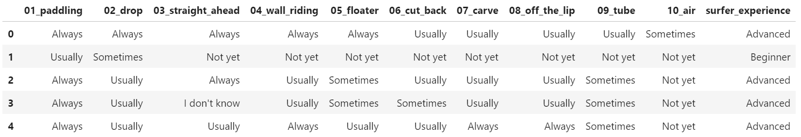

*Figure 2 - Extract of the dataset showing the ten input features (manoeuvres) and one target feature (experience)*


## 1.2 Problem Statement

The problem to be solved is the lack of methods to determine what is the experience level of a surfer given a set of manoeuvres he's able to perform.

The problem has already been quantified during my PhD thesis. *Figure 3* describes the frequency of execution of each manoeuvres by all the surfers consulted. Note that a lot of surfers are able to paddle (bottom), but only few are able to perform aerial manoeuvres (top). 

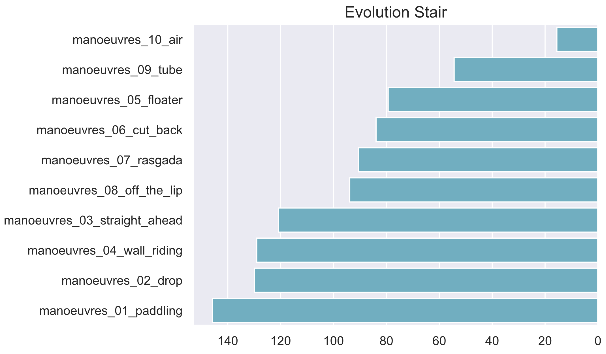
*Figure 3 - Surfer evolution: the horizontal axis represents the sum of the answers for each manoeurvre.*


### Expected Solution Statement 

The proposed solution consists in applying a clustering technique to statistically differentiate the levels of experience in groups accordingly to the performed manoeuvres.
As observed in *Figure 1*, the manoeuvres are a sound approach to identify the levels.
A beginner is likely to only paddle, whilst a pro is likely to perform aerial manoeuvres.
The problem will be approached as supervised.
I intend to use the PCA for dimensionality reduction for the following reason: to visualize how features are similar, by comparing the directions and modules of the vector that represents them.

The solution is **quantifiable**, **measurable** and **replicable**: The solution will be expressed as coordinates of each surfer's manoeuvres in the byplot. Also, the distance among points will indicate the formation of clusters. The solution will be measured by its number and proximity of clusters. The solution is **replicable**: The solution will be replicable once more data is inserted in the dataset.

[supervised solution Decision Tree]

------


## 1.3 Metrics

**Accuracy** is the metric chosen to measure the performance of the Decision Tree Prediction Model. Accuracy describes how good a model is, in terms of how many cases were correctly classified. In this project Accuracy describes how many times the surfer's experience level was correctly classified, relatively to the total number of cases. In mathematical terms, Accuracy is the ratio between the number of correctly classified points and the number of total points, as shown is *Figure 4*.

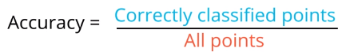

*Figure 4 - Accuracy equation*

------

# 2. Analysis

## 2.1 Data Exploration

The dataset of this analysis is composed by a single Dataframe containing 165 rows and 11 columns.
Each row represents a surfer.
The first ten columns represent the performed manoeuvres of each surfer, whilst the last one represents his experience level, as seen in Figure 3.

As seen in *Figure 5* , the great majority of the interviewed surfers is always able to perform the first four manoeuvres. 

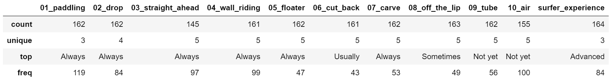

*Figure 5 - Descriptive statistics about each feature*

The available answers for each manoeuvre are: 'Not yet', 'Sometimes', 'Usually', 'Always' or 'I don't know'.
The available answers for surfer_experience are: 'Beginner', 'Intermediate' and 'Advanced'.

A sample of the dataset is represented by the series in *Figure 6*. This sample corresponds to an Advanced surfer who's sometimes able to perform aerial manoeuvres, and is always able to perform basic manoeuvres.

```python
01_paddling             Always
02_drop                 Always
03_straight_ahead       Always
04_wall_riding          Always
05_floater              Always
06_cut_back            Usually
07_carve               Usually
08_off_the_lip         Usually
09_tube                Usually
10_air               Sometimes
surfer_experience     Advanced
Name: 0, dtype: object
```

*Figure 6 - A sample from de dataset demonstrating the manoeuvres an Advanced surfer is able to perform*

## 2.2 Exploratory Visualization

Among the 165 surfers, 84 are Advanced, 66 Intermediate and 14 Beginner, as represented in *Figure 7* . This visualization indicates how the dataset is distributed: highly left-skewed.

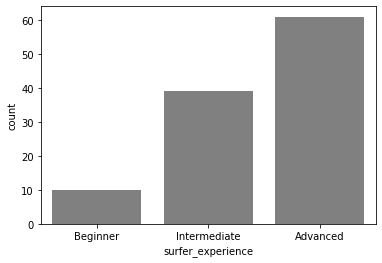

*Figure 7 - Surfer's level distribution*

In order to understand how often each manoeuvre is performed, the following three graphs are interesting (*Figure 8, 9 and 10*). 

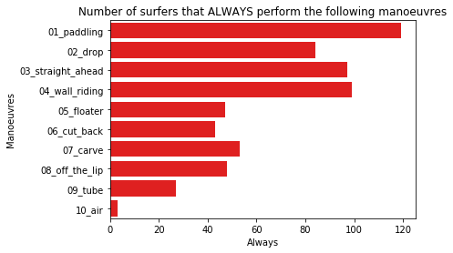
*Figure 8 - In red, the quantity of manoeuvres that are **Always** performed*

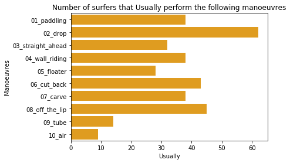
*Figure 9 - In orange, the quantity of manoeuvres that are **Usually** performed*

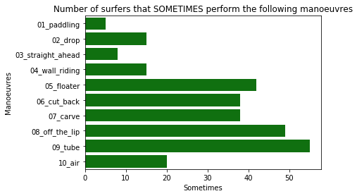
*Figure 10 - In green, the quantity of manoeuvres that are **Sometimes** performed*


A table summarizing these results is presented as well (*Figure 11*):

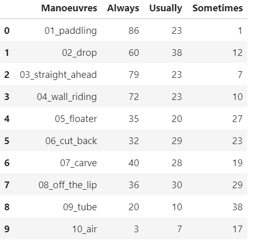

*Figure 11 - Summary of the frequency each manoeuvre is executed*


## 2.3 Algorithms and Techniques

The following algorithms contribute to the proposed solution:

### Principal Component Analysis (PCA)

The Principal Component Analysis is based of the Eingenvalue and Eigenvector of Linear Algebra. It's purpose is to perform dimensionality transformations of features. One of the main advantages of manipulating dimensions is to simplify the problem to a human interpretable domain. In this project, ten manoeuvres dimensions are reduced to only two, whilst maintaining significant variance. Its necessary in order to visualize the clusters and also to help the understanding of how the features relate to each other, as they become vectors in a plane. The similarity of direction and intensity of the vectors indicate how correlated they are.

> "Principal Component Analysis (PCA) is a statistical procedure that orthogonally transforms the original n coordinates of a data set into a new set of n coordinates called principal components."
>
> Source: https://www.sciencedirect.com/science/article/pii/B9780128128008000059


### Decision Tree

A decision tree allows the creation of rules that rationalize the prediction of the surfer's experience level. "The main advantage [of a decision tree] is interpretability" (Conrrado Mencar, 2013, https://www.researchgate.net/post/What_are_pros_and_cons_of_decision_tree_versus_other_classifier_as_KNN_SVM_NN). A decision tree is well suited for this problem because its able to handle the classification of multinomial features: the different surfer's level of experience.

A decision tree is a graphically interpretable method that guides the reasoning about a classification problem. In other to interpret it, one must answer questions in every node of the tree. Theses questions are typically of the "greater" or "lesser" than type. If greater, then a path is chosen. If lesser, then a secondary path is chosen. This reasoning repeats at each node. Therefore, the number of decision nodes, which represent the branches and leaves (the shape of the tree) is of great relevance, since they influence the model's complexity. Its most interesting concepts are:

- **Depth of the tree**. The depth of the tree determines how many intermediate decisions must be made in order to formulate the final classification decision. Naturally, a tree complexity depends of its depth. If the performance of the model is at stake, one should look into simplifying the tree by reducing its number of levels;
- **Minimum number of samples required to form a leaf**. This concept, which is also a parameter in the [Scikit Learn][https://scikit-learn.org/stable/modules/generated/sklearn.tree.DecisionTreeClassifier.html] avoids the overfitting of the model, by establishing a minimum number of samples required to determine a decision leaf. In this project, in the case of the surfers level prediction, this parameter may inhibit some dubious answer from the surfer that responded the questionnaire which originated the dataset.


## 2.4 Benchmark

The benchmark consists of comparing the **Decision Tree Model** vs. **Naive Bayes Model**.

___

# 3. Methodology

## 3.1 Data Preprocessing

The following preprocessing steps were taken:

**Data and feature translation.** This Dataframe was generated in Portuguese, hence the need to translate it to English. Three items were translated:

- The column names;
- The adverb representing the frequency of execution of each manoeuvre;
- The level of experience of the surfer.

**Feature renaming.** For instance, the first input features was initially named `manoeuvres_01_paddling`. It's a long name. Therefore, it was renamed to `01_paddling`, making it shorter and easier to code. The `manoeuvres` was removed from the other features as well.

**Data scaling.** The frequency adverbs are categorical, therefore they were replaced by numbers varying from 0 to 1, depending on the intensity each represents. The following scale was applied (*Figure 12*):

```python
replacement_dict = {
    'Not yet': 0,
    'Sometimes': 0.33,
    'Usually': 0.66,
    'Always': 1,
    "I don't know": np.nan,
}
```

*Figure 12 - Replacement dictionary used to scale frequency adverbs in a numerical format*


**NaN managing.** Whenever a surfer answered "I don't know", a `np.nan` (not a number) was registered as answer. Hence, the answers who had at least a `nan` were discarded.


## 3.2 Implementation

The following implementation steps were taken:

**Data splitting (input and output).** Feature were split in input and output, defining the X matrix, and y vectors needed for the algorithms.

**Correlation analysis.** Numbers are good, but colors are better!

> "The stronger the red, the stronger the correlation"

It can be noticed some correlation among the 05_floater and the 06 to 09 manoeuvres, which indicates that a surfer that is able to perform a floater, is also able to perform a cut_back, carve, off_the_lip and catch a tube (*Figure 13*).

On the other hand, a surfer that surfs straight_ahead is not likely to perform the manoeuvres mentioned before.

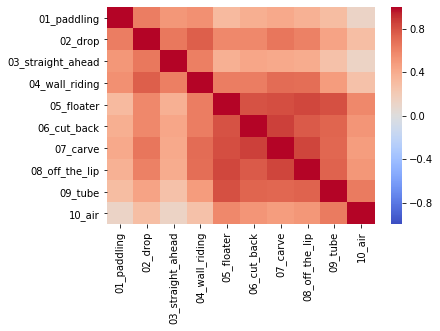

*Figure 13 - Correlation Matrix among manoeuvres*

**Feature Similarity Analysis (Dimensionality Reduction with PCA).** Since we have 10 manoeuvres, we would need a graph with 10 dimensions in order to visualize how the experience levels are distributed.
Hence, we apply the PCA technique (*Figure 14*).

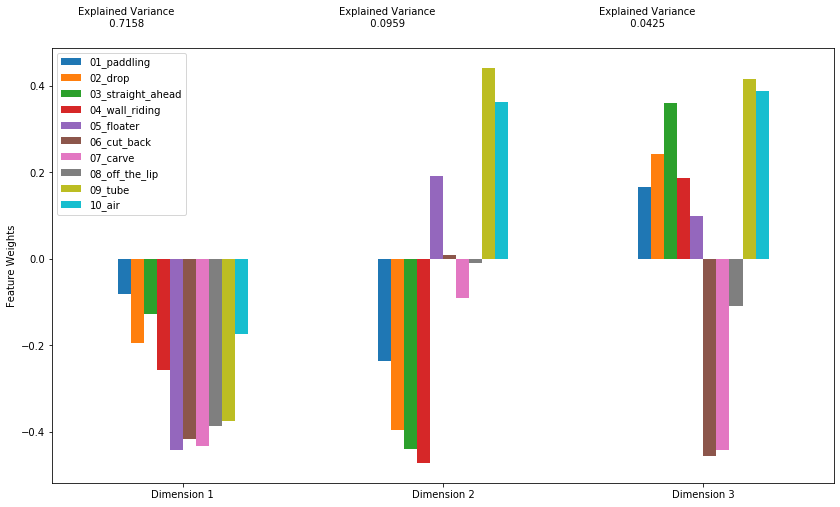

*Figure 14 - Visualization of which manoeuvres constitute each PCA dimensions*

The insights we get from the 3 PCA dimensions are:
- Dimension 1 indicates all manoeuvres influence the experience level;
- Dimension 2 indicates that manoeuvres 'floater', 'tube' and 'air' are some how closely oriented. As opposed to manoeuvres 1, 2, 3, 4 and 7;
- Dimension 3 indicates that manoeuvres 'cut_back', 'carve' and 'off_the_lip' are some how closely oriented.

These are only assumptions that must be verified later.

**Interpreting PCA Biplot.** In the biplot visualization the direction of the vectors indicate how aligned they are with each other (*Figure 15*).

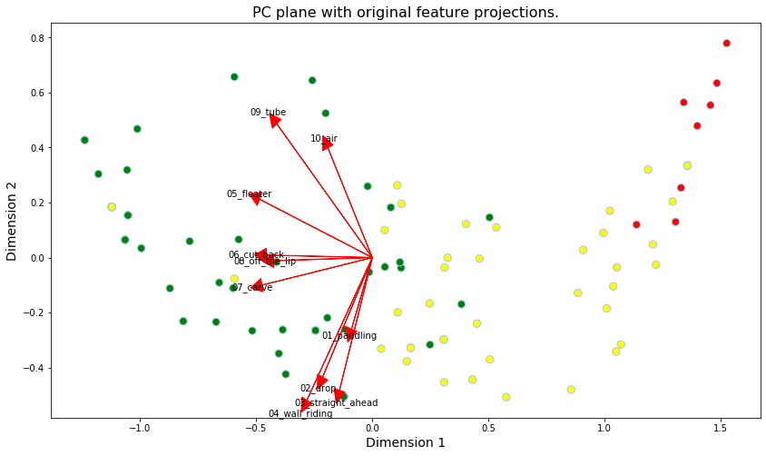

*Figure 15 - Manoeuvres represented as vectors in a reduced bi-dimensional plan*

The first four manoeuvres (Paddling, Drop, Straight ahead and Wall riding) are close on the bottom of the figure.
Cut_back, carve and off_the_lip are also close to each other, on the left of the figure parallel to the horizontal axis.
The last three (floater, tube and air) are a bit far from each other.
The interesting thing about these vectors is the significance of their angles.
The easiest manoeuvre to perform is paddling, whilst the hardest is air.
Therefore, the difficulty of each manoeuvre is expressed clock-wise.
Hours in a clock are equivalent to the experience required.
If we had to to segment the surfer's experience in 10 cluster, we'd succeed by following the manoeuvres clock-wise.
This represents a verification concept.

We could imagine a 5 cluster division:
1. Paddling, Drop, Straight ahead and Wall riding
2. Cut_back, Carve and off_the_lip
3. Floater
4. Tube
5. Air

Or even, a simpler, 3 cluster division:
1. Paddling, Drop, Straight ahead and Wall riding
2. Cut_back, Carve and Off_the_lip
3. Floater, Tube and Air


**Benchmark model**

```
Mean accuracy of the Multinomial Naive Bayes model: 0.7364

Probability for the BEGINEER class: 5.8%
Probability for the INTERMEDIATE class: 35.1%
Probability for the ADVANCED class: 59.1%
```

**Decision Tree Prediction model**

```
Random state:10		Accuracy: 95%
Random state:20		Accuracy: 97%
Random state:30		Accuracy: 95%
Random state:40		Accuracy: 95%
Random state:50		Accuracy: 100%
Random state:42		Accuracy: 93%
```

- The full decision tree is represented in (*Figure 16*);
- The 110 rows of data was randomly split using a 0.40 factor: 40% (44) became the testing set and 60% (66) became the training set;
- Accuracy was verified for different random_states. The smallest value (93%) which indicates the worst case scenario, for random_state = 42, is chosen as reference.

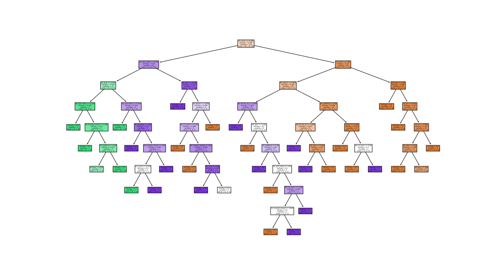

*Figure 16 - **Full** Decision Tree prediction model*


### Coding complication

The main complication found on the implementation of this project was on how to enhance the interpretability and performance of the Full Decision Tree model. As noticed in Figure 16, the full default tree has 8 levels of depth and 31 leaves. It's reasonable to assume that the human understanding, or even validation, of such a tree is effortful and tedious. An approach to simplify such model is to tune some parameters. For agility reasons, a secondary approach, relating to reducing the number of input features was chosen. Reducing features is a solution closer to the root cause of the tree's complexity, therefore of greater interest of the author. The next section reflects the chosen solution: to reduce from ten to two input features.

The lesson learned here is:

> "Before spending great effort in tuning the model, verify the possibility of reducing the scope of the data without sacrificing too much of its prediction performance."


## 3.3 Refinement

The refinement process of the Decision Tree model consisted of reducing the dataset to the two most important features: `07_carve` (46%) and `04_wall_riding` (16%).

The reduced decision tree model has 4 levels of depth and 9 leaves (*Figure 17*).

```
Random state:10		Accuracy: 86%
Random state:20		Accuracy: 88%
Random state:30		Accuracy: 88%
Random state:40		Accuracy: 79%
Random state:50		Accuracy: 81%
Random state:42		Accuracy: 81%
```

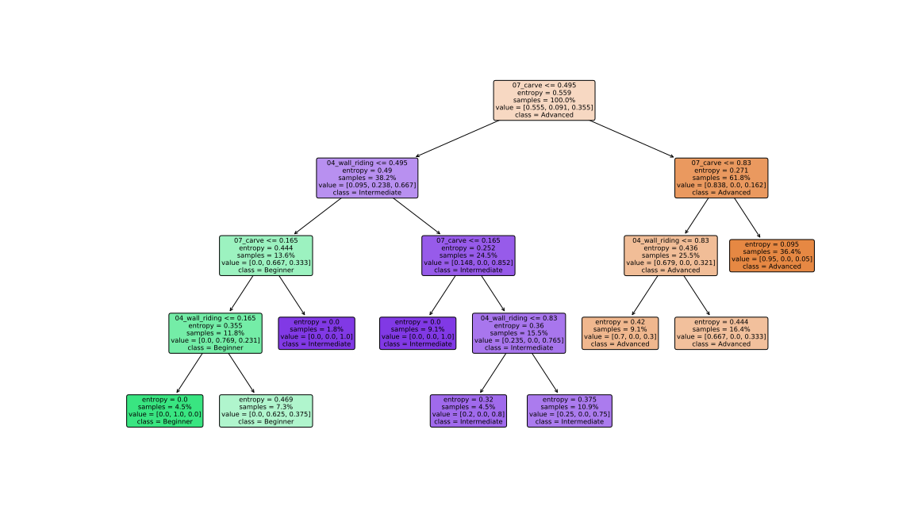

*Figure 17 - **Reduced** Decision Tree prediction model*


#### Interpreting the reduced model

- The obtained accuracy with the reduced model is 81%,verified for `random_state = 42`;
- As observed in the previous cell, its reasonable to say the reduced model has an 80% accuracy, therefore its prone to get right answers 4 out of 5 predictions.
- Standard deviation of Accuracy: 0.036

___

# 4. Results

## 4.1 Model Evaluation and Validation

The final model was chosen based on its supposed used: during a surfboard recommendation between a surfer and a shaper.

It's assumed that a surfers may find tedious to answer 10 questions. Hence a reduced model is more likely of success.

Two features account for around 60% of the total importance of the model (`07_carve: 44.9` and `04_wall_riding: 16.1`). Only theses two features compose the reduced and final model.

The final model has 4 levels of depth and 9 leaves (as seen in *Figure 17*), which leads an accuracy of 80%.


**The final model is reasonable and aligns with the expected solution:** The reduced model is chosen as the final model because it offers a reasonable accuracy (80%) whilst using only 20% of the inputs of the full model dataset.
In practice this means only two questions (instead of ten) are needed in order to predict the surfers experience level.


**The final model was tested with various input sets:** varied due to the verified random_states.

**The model is robust:** Different random states yield small accuracy standard deviation (0.036).


## 4.2 Justification

- The FULL decision tree accuracy is 26.5% above reference
- The REDUCED decision tree accuracy is 11.1% above reference

These results and solution are significant because they overcome the naive model (unexperienced shaper) by 47%.

The reduced decision tree could printed and used manually (without any computer). The full tree is too complex for that purpose;


____

# 5. Conclusion

## 5.1 Free-Form Visualization

The decision process provided by the tree represented in *Figure 17* starts with the evaluation of surfers capacity to perform the carve manoeuvre. If he usually (0.66) or always (1.00) execute it, he's considered an advanced surfer, as all the following leaves of the right branch are orange, which outputs the `class: Advanced` as seen in the orange boxes.

On the other hand if a surfer is unable to perform a carve or wall_riding manoeuvre, then he's classified as a beginner, and he'll cruise the most left branch of the tree, following the green leaves were `class: Beginner`.

A third surfer, intermediate would fall in the purple leaves, around the middle of the tree.


## 5.2 Reflection

The following sections describe the work process of this project.

**Data was explored:**

- the content of the first rows were observed,
- the size of the dataset was calculated (165 rows and 11 columns),
- the name of each column was explored,
- the unique values of the features were identified,
- data was statistically described.

**Data was visually explored:** Data was visually explored evidencing the left-skewed distribution of experience among the respondent surfers. The frequency of execution of each manoeuvre was calculated and plotted accordingly to the level of experience.

**Data was preprocessed:**

- Features were renamed,
- Data was translated to English and scaled with respect to the intensity of frequency adverbs,
- 45 Rows with any NaN (not a number) were discarded,
- Data was split into two: input (X) and output (y);

**Algorithms and models were implemented:**

- Data correlation was analyzed. Floater is a manoeuvre highly correlated to others.
- Feature similarity was analyzed. Within a PCA analysis, the vectors which represent each feature were compared, in terms of direction and intensity. The cut-back and off-the-lip manoeuvres are pretty similar.
- A Naive Bayes classifier for multinomial model was set as benchmark, which sets the accuracy reference at 55%.
- A decision tree with the full dataset was implemented yielding an accuracy of 93%.
- Two features are the most important: 07_carve (45% of importance) and 04_wall_riding (16.5%). The feature importance provided the insight to simplify the model by reducing its number of input features.
- A reduced decision tree with only 2 out of 10 input features was implemented, resulting in a lighter model with 80% accuracy. This represents the refined and chosen model.
- The model can be simplified to only two of the ten features, whilst maintaining 81% of accuracy. In practice, this means the shaper only needs to ask two instead of ten questions to the surfer to predict his experience level.
- Figures were generated to help the understanding of the decision process of each tree. The reduced model is more intuitive, as expected.
- Some experience levels declared by the surfers may be wrong, as the same manoeuvres inputs may yield different experience labels, as demonstrated in the section x. This is probably due to the subjectivity inherent in the statement of one's own experience.

**Interesting aspect**

The most interesting aspect of this project is that one single feature `07_carve` accounts for 45% of the models importance. This fact really surprised me. I didn't expect such a high number.

**Difficult aspect**

The most difficult aspect was the uncertainty about how to manage the NaN values. I'm not 100% comfortable about simply dropping any row that has a NaN in it.


## 5.3 Improvement

- The most promising aspect to improve the model is two fold:
  - Fine tune the decision tree with respect to `max_depth`, `min_samples_split` and `min_samples_leaf`. The `min_samples_leaf` parameter is promising because it can contribute to remove the purple box shown in the reduced decision tree from the green branch (for beginners) which seems incorrect;
  - Vary the number of features of the reduced models, start by analyzing with only one feature `07_carve` feature. Then, explore with three features, and so on.
- Explore different alternatives about managing NaN, which requires further research;
- Validate the decision tree (graphically generated) with expert shapers, in order to tune it;
- It's highly encourage the exploration and comparison of other supervised algorithms.


____

# References

Lundgren et al (2014)

> Lundgren, L., Newton, R. U., Tran, T. T., Dunn, M., Nimphius, S., & Sheppard, J. (2014). Analysis of manoeuvres and scoring in competitive surfing. *International Journal of Sports Science & Coaching*, *9*(4), 663-669.

Weaver e Bannerot (2009)

> Robert 'ingnut.'' Weaver, & Bannerot, S. P. (2009). Wingnut's complete surfing. International Marine/McGraw-Hill.

Peirão e Santos (2011)

> Peirão, R., &amp; Santos, S. G. D. (2012). Judging criteria in international professional surfing championships. Revista Brasileira de Cineantropometria &amp; Desempenho Humano, 14(4), 439-449.

Robison (2010)

> Surfing Illustrated: A Visual Guide to Wave Riding

Moreira e Peixoto (2014)

> Moreira, M., &amp; Peixoto, C. (2014). Qualitative task analysis to enhance sports characterization: a surfing case study. Journal of human kinetics, 42(1), 245-257.

Lundgren et al. (2014)

> Lundgren, L., Newton, R. U., Tran, T. T., Dunn, M., Nimphius, S., &amp; Sheppard, J. (2014). Analysis of manoeuvres and scoring in competitive surfing. International Journal of Sports Science &amp; Coaching, 9(4), 663-669.

Hutt et al. (2001)

> Hutt, J. A., Black, K. P., &amp; Mead, S. T. (2001). Classification of surf breaks in relation to surfing skill. Journal of Coastal Research, 66-81.
> Mendez Villanueva et al. (2006)

Mendez-Villanueva, A., Bishop, D., &amp; Hamer, P. (2006).

> Activity profile of world-class professional surfers during competition: a case study. Journal of Strength and Conditioning Research, 20(3), 477.

Secomb et al. (2015)

> Secomb, J. L., Sheppard, J. M., &amp; Dascombe, B. J. (2015). Time–motion analysis of a 2-hour surfing training session. International journal of sports physiology and performance, 10(1), 17-22.
