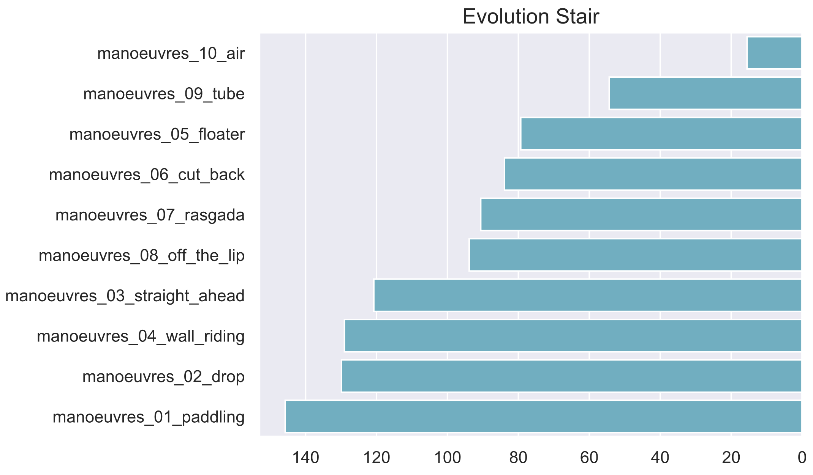
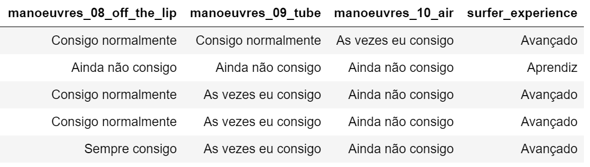
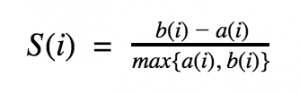

# Machine Learning Engineer Nanodegree


Guilherme Branco Loureiro

July 28th, 2019

### Capstone Proposal: 

## Identifying Surfer's Experience Based on Performed Manoeuvres 

____


### 1. Domain Background

Research about surfboard is scarce.
A query for 'Surfboard' in [Scopus](https://www.scopus.com/results/results.uri?numberOfFields=0&src=s&clickedLink=&edit=&editSaveSearch=&origin=searchbasic&authorTab=&affiliationTab=&advancedTab=&scint=1&menu=search&tablin=&searchterm1=surfboard&field1=TITLE_ABS_KEY&dateType=Publication_Date_Type&yearFrom=Before+1960&yearTo=Present&loadDate=7&documenttype=All&accessTypes=All&resetFormLink=&st1=surfboard&st2=&sot=b&sdt=b&sl=24&s=TITLE-ABS-KEY%28surfboard%29&sid=836201fdfd01a316e29aaf87c508a17e&searchId=836201fdfd01a316e29aaf87c508a17e&txGid=e849352791f4cd3a5c7fa87e60011e9d&sort=plf-f&originationType=b&rr=) results only 235 documents. 
Surfing is a sport in which a surfer performs manouevres over the surface of a wave with a surfboard.
The more experienced the surfer, the more complex manoeuvres he's able to perform.
The right surfboard specification implies in acknowledging theses features and translating them into surfboard specs.
Therefore, strong correlation between the surfer's **experience level** and the range of **manoeuvres** is expected. 
The objective of this work is to propose a clustering approach to predict the surfers experience level given a set of manoeuvres.

There are no publications about this correlation (experience X manoeuvres), nor a clustering application that outputs experience related clusters based on manoeuvres. 

This problem is relevant because it could contribute to the surfboard specification process, making recommendation more assertive.

The problem might be solved with clustering methods such as K-Nearest Neighbors (KNN) or Gaussian Mixed Models (GMM). Also, the Principal Component Analysis (PCA) may contribute to reduce the dimensionality of the problem.

Related researches approach manoeuvres as follows:

- [Lundgren et al (2014)][1] analyses Manoeuvres and Scoring in Competitive Surfing;
- [Weaver e Bannerot (2009)][2] describe surfing manoeuvres.
- [Peirão e Santos (2011)][3] describe surfing manoeuvres.
- [Robison (2010)][4] graphically represent the manoeuvres.
- [Moreira e Peixoto (2014)][5] empirically group manoeuvres.
- [Lundgren et al. (2014)][6] describe the frequency of execution of manoeuvres in a championship.
- [Hutt et al. (2001)][7] propose a surfer level classification based on manoeuvres, without any clustering technique.
- [Mendez Villanueva et al. (2006)][8] show how the different surfing activities are divided.
- [Secomb et al. (2015)][9] present some statistics about surfing activities.

As a surfer for more than ten years, it's still not clear what is my level of experience. I'm confident many also have this doubt and may benefit from this proposal.

________


### 2. Problem Statement

The problem to be solved is the lack of methods to determine what is the experience level of a surfer given a set of manoeuvres he's able to perform.

One potential solution is to apply the GMM in order to specify the experience cluster of each surfer. It's expected that a surfer can be in the intersection of two levels (for instance intermediate-advanced). Hence the "mixed" attribute is desirable, reason why the KNN is a less interesting option.

The problem has already been quantified during my PhD thesis. *Figure 1* describes the frequency of execution of each manoeuvres by all the surfers consulted. Note that a lot of surfers are able to paddle (bottom), but only few are able to perform aerial manoeuvres (top). 


*Figure 1 - Surfer evolution: the horizontal axis represents the sum of the answers for each manoeurvre.*

------


### 3. Datasets and Inputs [100%]

The dataset features are listed bellow in *Figure 2*.
The first 10 features are **inputs** (related to the performed manoeuvres), and the last one is an **output** to be further used as benchmark.
This dataset was obtained during my PhD's research with Google Forms.
One valuable feature is the `surfer_experience` (target), which might allow comparison of the model.
The answers were captured in a CSV file, as sampled in *Figure3*.

```python
columns = [
    'manoeuvres_01_paddling',
    'manoeuvres_02_drop',
    'manoeuvres_03_straight_ahead',
    'manoeuvres_04_wall_riding',
    'manoeuvres_05_floater',
    'manoeuvres_06_cut_back',
    'manoeuvres_07_rasgada',
    'manoeuvres_08_off_the_lip',
    'manoeuvres_09_tube',
    'manoeuvres_10_air',
    'surfer_experience'
]
```
*Figure 2 - List of features*



*Figure 3 - Extract of the dataset showing three input features and one target feature*

------


### 4. Solution Statement

The proposed solution consists in applying a clustering technique to statistically differentiate the levels of experience in groups accordingly to the performed manoeuvres.
As observed in *Figure 1*, the manoeuvres are a sound approach to identify the levels.
A beginner is likely to only paddle, whilst a pro is likely to perform aerial manoeuvres.
The problem will be first approached as unsupervised  and afterwards as a supervised, when the `surfer_level` feature will be compared to the predicted cluster from the unsupervised approach.
I intend to use the PCA for dimensionality reduction for the following reasons:

- to visualize how features are similar, by comparing the directions and modules of the vector that represents them;
- to reduce the clustering problem to a two-dimension space (byplot), so the clusters can be intuitively visualized.

The solution is **quantifiable**, **measurable** and **replicable**: The solution will be expressed as coordinates of each surfer's manoeuvres in the byplot. Also, the distance among points will indicate the formation of clusters. The solution will be measured by its number and proximity of clusters. The solution is **replicable**: The solution will be replicable once more data is inserted in the dataset.

------


### 5. Benchmark Model

The benchmark consists of comparing three approaches, the **KNN** vs. **GMM** vs. **Known label** (`surfer_experience`).

The following metrics can be used:

- Number of clusters;
- Precision compared to the known label

------


### 6. Evaluation Metrics

As the evaluation metric, the Silhouette Coefficient is planned to evaluate the distance among points.

> The **Silhouette Coefficient** tells us how well-assigned each individual point is. If *S(i)* is close to 0, it is right at the inflection point between two clusters. If it is closer to -1, then we would have been better off assigning it to the other cluster. If *S(i)* is close to 1, then the point is well-assigned and can be interpreted as belonging to an ‘appropriate’ cluster. [ODSC - Open Data Science](https://medium.com/@ODSC/assessment-metrics-for-clustering-algorithms-4a902e00d92d)
> 

The Silhouette Coefficient can be calculated with the following equation:



------


### 7. Project Design

The following activities are expected in order to solve the problem:

1. Data Exploration
2. Feature Scaling
3. Sample Selection
4. Feature Relevance
5. Feature Transformation - Dimensionality Reduction (with PCA)
6. Biplot Visualization
7. Cluster Creation
8. Cluster Visualization (Byplot)
9. Cluster Benchmarking (GMM vs. KNN vs. 'surfer_experience')
10. Cluster Evaluation (Silhouette Coefficient)


The following algorithms are expected to be used:

- Principal Component Analysis (PCA);
- K-Nearest Neighbors (KNN);
- Gaussian Mixed Models (GMM).

_____


## References

Lundgren et al (2014)

> Lundgren, L., Newton, R. U., Tran, T. T., Dunn, M., Nimphius, S., & Sheppard, J. (2014). Analysis of manoeuvres and scoring in competitive surfing. *International Journal of Sports Science & Coaching*, *9*(4), 663-669.

Weaver e Bannerot (2009)
> Robert 'ingnut.'' Weaver, & Bannerot, S. P. (2009). Wingnut's complete surfing. International Marine/McGraw-Hill.

Peirão e Santos (2011)

> Peirão, R., &amp; Santos, S. G. D. (2012). Judging criteria in international professional surfing championships. Revista Brasileira de Cineantropometria &amp; Desempenho Humano, 14(4), 439-449.

Robison (2010)

> Surfing Illustrated: A Visual Guide to Wave Riding

Moreira e Peixoto (2014)

> Moreira, M., &amp; Peixoto, C. (2014). Qualitative task analysis to enhance sports characterization: a surfing case study. Journal of human kinetics, 42(1), 245-257.

Lundgren et al. (2014)

> Lundgren, L., Newton, R. U., Tran, T. T., Dunn, M., Nimphius, S., &amp; Sheppard, J. (2014). Analysis of manoeuvres and scoring in competitive surfing. International Journal of Sports Science &amp; Coaching, 9(4), 663-669.

Hutt et al. (2001)

> Hutt, J. A., Black, K. P., &amp; Mead, S. T. (2001). Classification of surf breaks in relation to surfing skill. Journal of Coastal Research, 66-81.
Mendez Villanueva et al. (2006)

Mendez-Villanueva, A., Bishop, D., &amp; Hamer, P. (2006).

>  Activity profile of world-class professional surfers during competition: a case study. Journal of Strength and Conditioning Research, 20(3), 477.

Secomb et al. (2015)

> Secomb, J. L., Sheppard, J. M., &amp; Dascombe, B. J. (2015). Time–motion analysis of a 2-hour surfing training session. International journal of sports physiology and performance, 10(1), 17-22.
